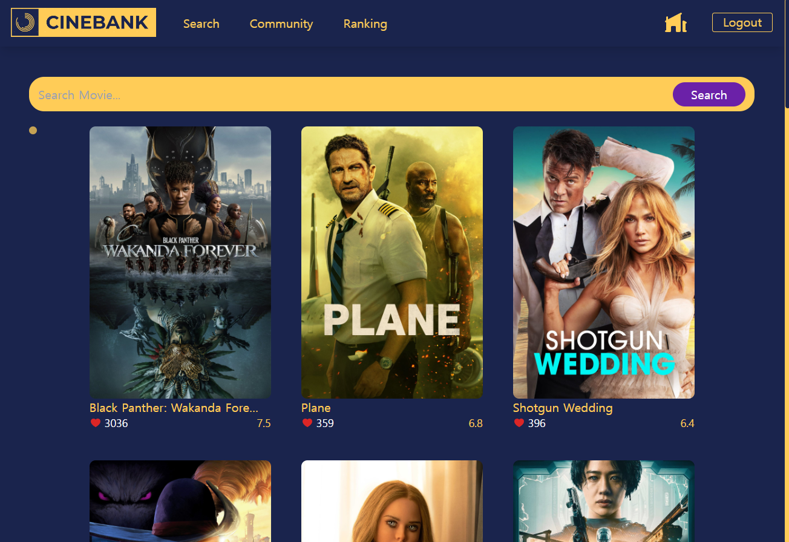
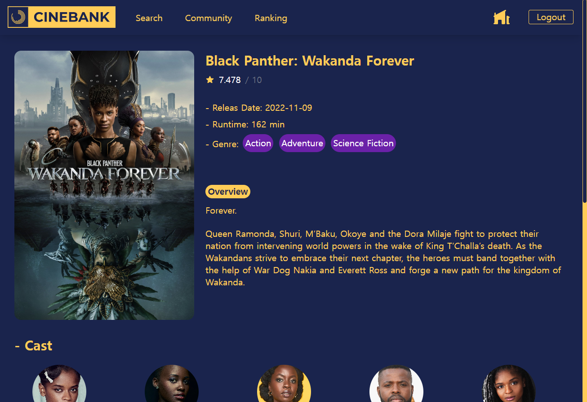
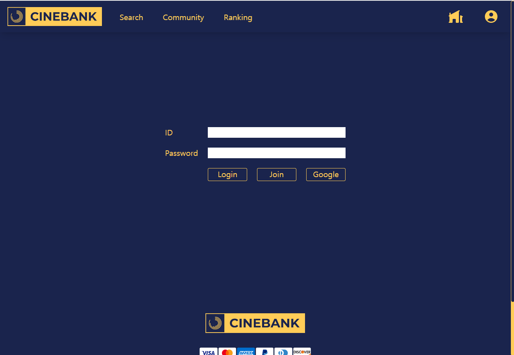

# CINEBANK

---

1. 기획의도

영화를 좋아하시는 분들이나 더 정확한 정보를 얻을 수 있는 웹사이트를 만들어보고자 했습니다.
영화에 대한 상세한 정보들을 검색할 수 있고, 커뮤니티 페이지를 통해 영화를 감상한 후에 리뷰를 작성할 수 있습니다.
또한, 리뷰에 대한 작성자의 좋아요 수를 통해 무분별한 리뷰들을 필터링할 수 있게끔 구성했습니다.

2. 기능

- 영화 검색 : 검색어 자동 완성, 검색 결과 출력
  

- 영화 상세 정보 확인 : 영화 상세 정보 API 출력
  

- 커뮤니티 페이지 : 영화 리뷰 커뮤니티 게시물 확인 및 작성 가능 (비횐원은 게시물 읽기만 가능)
  

- 로그인 페이지 : 기본 이메일 주소로 가입하거나 구글 로그인 가능
  
